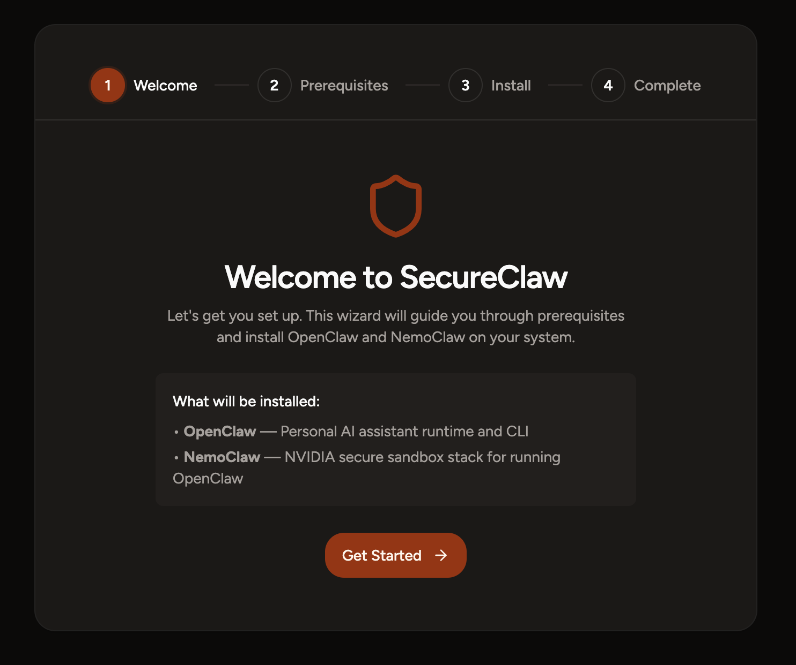
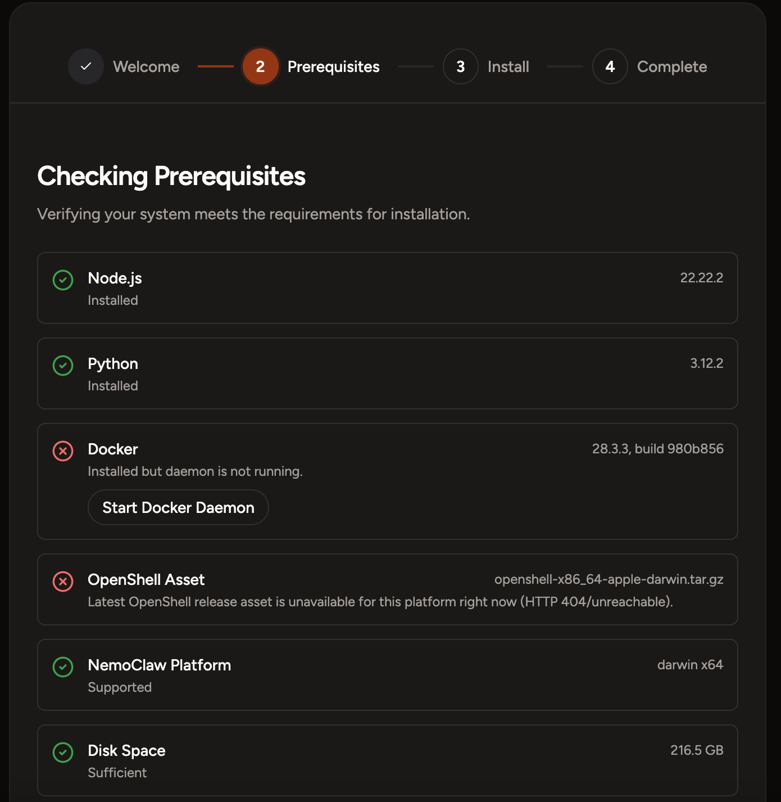
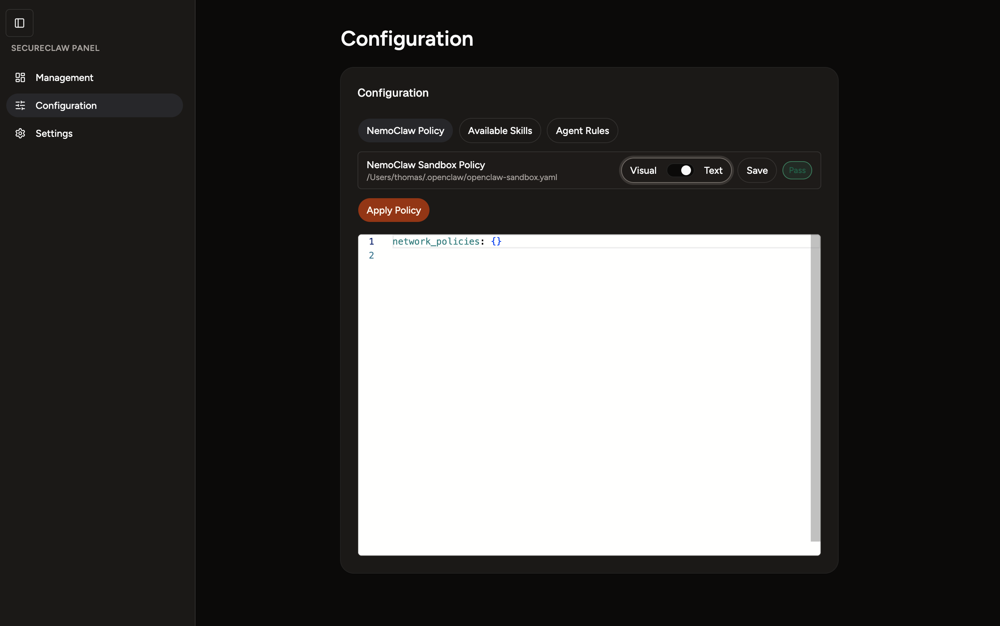
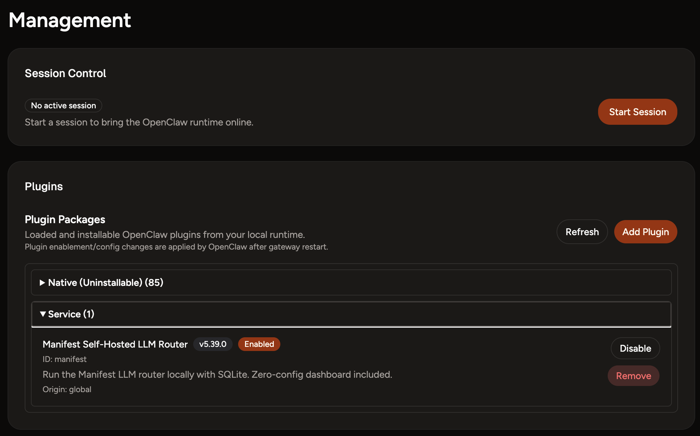
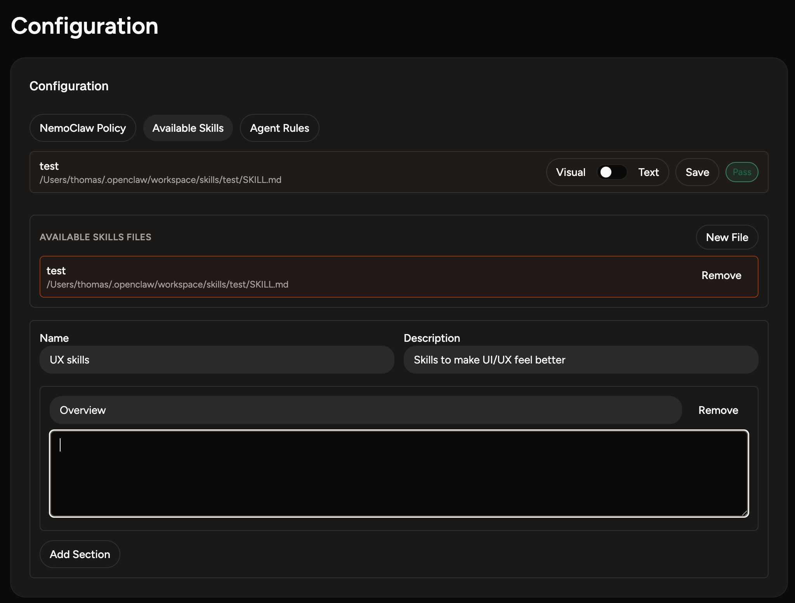
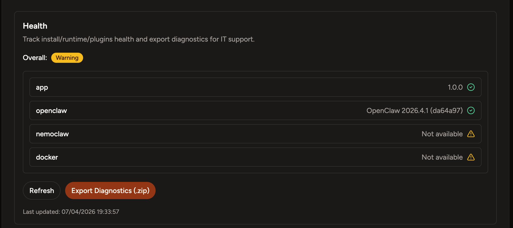

# SecureClaw App


> **Note** : This is 1 week POC to demonstrate the capability of building an installer app. This could not be pursued as I don't have an Apple Silicon Mac

SecureClaw is a desktop installer and operations panel for **OpenClaw** and **NVIDIA NemoClaw**.
It guides setup, centralizes runtime/plugin operations, and provides configuration + health diagnostics in one app.

## What The Project Includes

* Guided onboarding wizard for stack installation
* Management panel for runtime sessions and plugin lifecycle
* Configuration panel for NemoClaw policy, available skills, and agent rules
* Settings health check with diagnostics export and stack uninstall tools

## Product Walkthrough

### 1) Install Wizard - Step 1 (Welcome)



The first screen introduces the SecureClaw setup flow and what will be installed:
OpenClaw runtime + NemoClaw secure sandbox stack.

### 2) Install Wizard - Step 2 (Prerequisites)



This step verifies host readiness (for example Node.js, Python, Docker daemon, and platform requirements)
before allowing installation to continue.

### 3) Global UI



After install, the app switches to a global panel layout with a left navigation and tabbed workspace:
**Management**, **Configuration**, and **Settings**.

### 4) Management Panel



The Management view is used for day-to-day runtime control:

* Start/stop OpenClaw runtime sessions
* View active session state
* Browse, enable/disable, import, validate, and remove plugin packages

### 5) Configuration Panel



The Configuration view lets you maintain key stack documents in **Visual** and **Text** modes:

* NemoClaw Policy (YAML editor + apply action)
* Available Skills (Markdown-based files)
* Agent Rules (Markdown-based files)
* Built-in validation and save/apply workflow

### 6) Settings - Health Check



The Settings health section provides:

* Overall health severity (install/runtime/plugins)
* Version visibility (app, OpenClaw, NemoClaw, Docker)
* Manual refresh
* Diagnostics bundle export (`.zip`) for support
* OpenClaw + NemoClaw stack uninstall action

## Quick Start (Development)

1. Install dependencies:

```Shell
npm install
```

1. Start renderer:

```Shell
npm run dev:renderer
```

1. In a second terminal, launch desktop app:

```Shell
npm run dev:desktop
```

Optional simulation mode (skip real install side effects in development):

```Shell
npm run dev:desktop:sim-install
```

## Useful Commands

* `npm run start` - Build + launch Electron app
* `npm run build` - Build main and renderer
* `npm run test` - Run Jest tests
* `npm run type-check` - Run TypeScript checks

## Tech Stack

* Electron
* React 19
* TypeScript
* Vite
* Zustand
* Monaco Editor + RJSF (config editing)
* Jest

